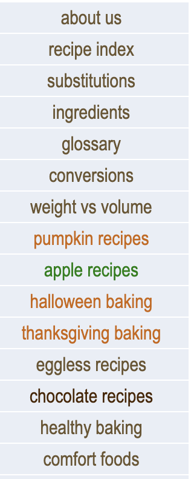
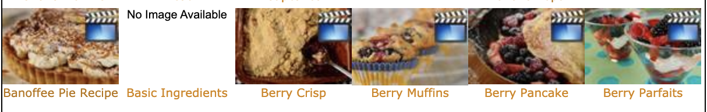
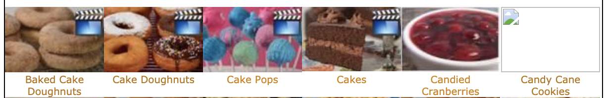
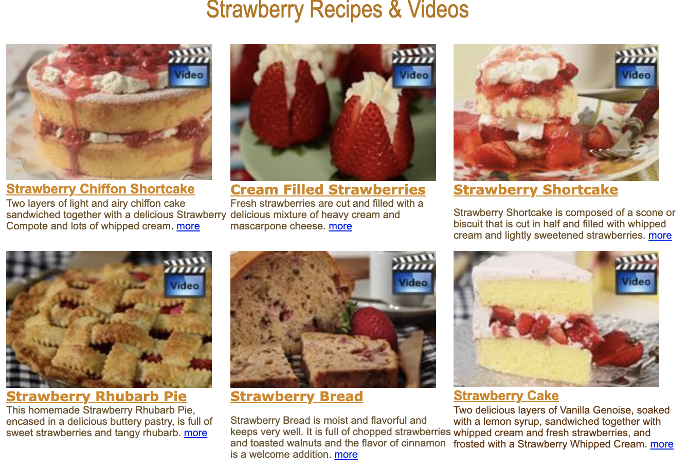

# DH150 Assignment 1: Heuristic Evaluation by Annya Dahmani

## Mid-aged Women's Happiness: Baking Recipe Resources

> My mom is a mid-aged woman, so I am focusing on what makes my mom happy for this project, specifically what parts of cooking make my mom especially happy. My mom, like many other mid-aged women, loves to cook. She loves making her own recipes, copying famous chef's recipes, and sharing her creations with her friends and family. I think especially now, with a lot of people staying home to work due to COVID-19, a lot of people, including mid-aged women, have found happiness in cooking and have taken it as their new hobbie and source of joyness during these difficult times. I wanted to explore different cooking sources that someone like my mom would use. I decided to specifically focus on baking for this assignment. I found two resources for baking recipes and information: an app for cake and baking recipes (Cake and Baking Recipes For You) and a website filled with unique and tasty baking recipes (Joy Of Baking). 

### Severity Rating Scale
This rating uses a 1-3 scale to show what each number corresponds to in terms of problem and priority. **Credit for scale rating given to:** https://www.nngroup.com/articles/how-to-rate-the-severity-of-usability-problems/

Scale  | Problem  | Information  |
:---: | :---  | :---: |
1  | Cosmetic only |  need not be fixed unless extra time is available on project  |
2  | Minor usability | fixing this should be given low priority  |
3  | Major usability | important to fix, so should be given high priority  |

### Resource no. 1: Joy of Baking
#### Description 
> URL: https://www.joyofbaking.com/ 

> This website is called Joy of Baking. It is a baking recipe website where you can find delicious desert ideas. Baker Stephanie Jaworksi created Joy of Baking in 1997 as a way to engage with other bakers who share the same love and passion for deserts as she does. Each of her recipes comes with a video that shows bakers how to make the perfect desert. The homepage has a categorical index on the left side of the page as well as on the top of the page. 

#### Initial overall evaluation
> My initial overall evaluation about this webpage was how busy and chaotic it looked. There is just too much happening and it's overwhelming. I also notice random pictures and text floating on the page and a lot of white space on the right side of the page. At first glance, it seemed like there was no uniformity within the page. Another initial observation I had was the color coding of the left categorical index. The color coding seemed off where there were light brown, darkbrown, orange, and green colored fonts. I was unsure whether things were normal text or if they were meant to be clicked to take you to another page. 

#### Heuristics evaluation
> Here I will discuss all 10 heuristics with sensible argument/comments and possible solutions that I have come up with to help address the arguments/comments.

##### 1. Visibilty of system status
> Should give feedback within a reasonable time about what the user is doing.

Rating  | Arguments/comments  | Possible solutions  |
:---: | :---  | :---  |
1 | There are pictures and fonts that are on the page that user's would be unsure of whether it is something that is supposed to be clicked or if it is picture. For example, the "Subscribe Now" text is actually a button where if a user clicks it, then they can subscribe to the page. But it needs to be more visible that it's a button and not just text. | Make text that is meant to be clicked look like buttons |
1 | The search bar has a magnifying glass next to it. However it is unclear if that is what a user is supposed to click when attempting to search a recipe. When a user's cursor hovers over the magnifying button, the cursor doesn't change into a hand which most cursors do when encountered with a button. | Make the magnifying glass into a button where if a cursor hovers over it, it will change to a hand cursor |
2 | When clicking the categories in the index on the left side of the page, a user has to click directly on the text in the box. If you click on the light blue tint that doesn't have text on it, then the user won't be directed anywhere. | I think the whole light blue box needs to be a button where if you click on just the blue part without text, it will still take you to the recipe a user is looking for. |
3 | There is no feedback given when a user tries to search something after their initial search in the search bar. After the initial search, if a user tries to search for a new recipe or ingredient, the user is taken to a blank page | Make sure users can search more than just their first initial search |

##### 2. Match between system and real world
> The system should speak the users langauge with words and designs that the user is familiar with and understands.

Rating  | Arguments/comments  | Possibile solutions |
:---: | :---  | :---  |
1 | The search bar needs to be more clear that the text that's supposed to be typed there is what the user is intending on searching. The magnifying glass does not fully represent that. | I think the magnifying glass should be replaced with a Search button and there should be a default text in the box that says search a recipe. |
3 | Below the left category index there is an orange figure that looks like a slanted wifi icon. I was unsure what it was and I clicked it and it brought me to a FeedBurner page for the website. I am still unsure what it is and why this needs to be on the page.  | Remove the icon from page |

##### 3. User control and freedom
> Users need a clearly marked emergency exit to leave that state.

Rating  | Arguments/comments  | Possibile solutions |
:---: | :---  | :---  |
3 | There is no way to go back to the recipe a user was viewing previously. The only way to go back is to click the 'home' button and then redo the steps to get to where a user was in the first place | Create a back button that traces all the steps a user went through to get somewhere so they don't have to resort to only using the home button. |
3 | User is unable to search more than once | Allow users to search different things more than once |

##### 4. Consistency and standards
> Maintains established meaning of visual elements. The design is consistent throughout the web/app and doesn't confuse users. 

Rating  | Arguments/comments  | Possibile solutions |
:---: | :---  | :---  |
1 | The left categorical index has text with different font colors. This is inconsistent as there are orange, light brown, dark brown, and green colors that don't establish and meaning.  | Keep the font color the same throughout. |
3 | Once a user searches for something from the home page, the magnifying box switches intoo a "Search" button. After searching once, the user is no longer able to search again when using the new button and instead shows a blank page | Keep the search button consistent throughout. Make sure user is able to search more than once |
1 | When an image isn't available there are two options the webpage uses: either a blank picture with "No Image Available", or a blank picture with an icon on the top left. This is inconsistent | Either keep the "No Image Available" for all recipes with no images or make sure to provide an image for each recipe (can be just a picture from the web as a filler image) |
3 | Sometimes, depending on what part of the site you're on, the home title "Joy of Baking.com" is no longer used as a home button. Some times a user can click that icon and it will take them to the home page, but other times when a user clicks it, it no longer serves as a means to go to the home page | Make the icon consistent throughout where it can always be used to go home. |
1 | The categories on the top of the site change depending on what part of the site a user is on | Make sure the top categories remain the same no matter where a user is on the site. |
1 | Sometimes when users click one of the options in the left menu bar, the font will all change to light brown and the categories will change places and some will go away and some new ones would be added. | Make sure the left menu categories remain the same no matter where a user is on the site and the color remains the same. |

##### 5. Error prevention
> Prevent people from having to redo their work and provides as a safety net. 

Rating  | Arguments/comments  | Possibile solutions |
:---: | :---  | :---  |
Good | If a user types in the search bar and spells something incorrectly, the search looks for words similar to what the user was trying to input | Good as is |

##### 6. Recognition rather than recall
> Provide suggestions to send signals to information from our memory. Allows users to receive cues that give context in actions.

Rating  | Arguments/comments  | Possible solutions  |
:---: | :---  | :---  |
1 | The categories on the top of the site change depending on what part of the site a user is on. This makes it hard for users to be able to recognize their way to navigate the site. Having categories appear and disappear can be confusing to users and their able to recognize. | Make sure the top categories remain the same no matter where a user is on the site so that recognition can remain in tact. |

##### 7. Flexibility and efficiency of use
> Flexible processes can be carried out in different ways so users can choose their method of interaction.

Rating  | Arguments/comments  | Possible solutions  |
:---: | :---  | :---  |
3 | There is no filter or sort method when a user searches for a recipe or ingredient. Instead, the page shows all possible options, which is both inefficient and unflexible | Have a sorting algorithm where users can sort either based on time it takes to complete recipe, number of ingredients, servings size, etc. |

##### 8. Aesthetic and minimalist design
> Making sure content and visual design is focused on the essentials.

Rating  | Arguments/comments  | Possible solutions  |
:---: | :---  | :---  |
1 | There doesn't need to be a menu on the top and left of the page. Some of them are repetitive. | Delete one of the menu options |
1 | There are four different font colors on the left menu, making it chaotic | Simplify the font color and use only one color for the text |
3 | Some of the designs are confusing because a user can't tell if it's something that is supposed to be clicked, or it's just a text floating | Make buttons appear like buttons where it's obvious that that is something a user should click on |
1 | There doesn't need to be a video icon on every picture of a recipe when every recipe has a video accompanied with it. It's repetitive and hinders the minamilist design. | Remove the video icon that is layered on every picture throughout the page. |
1 | After every description under a photo, there is a blue hyperlinked "more" text. This is unecessary when it appears in every description. Users know that they can simply click the title and it will take them tothe information about the recipe. The blue color hinders the minamilist design. | Remove the blue "more" hyperlink. |
1 | There's text that says "Scroll Down For More Recipes" that floats under the top menu bar. It is self explanatory that users would scroll down to find more recipes. The text is in a random place and doesn't help with usability. | Remove floating text that  says "Scroll Down For More Recipes". |

##### 9. Help users recognize, diagnose, and recover from errors
> akfmdlaksmf;alksdfma

Rating  | Arguments/comments  | Possible solutions  |
:---: | :---  | :---  |

##### 10. Help and documentation
> akfmdlaksmf;alksdfma

Rating  | Arguments/comments  | Possible solutions  |
:---: | :---  | :---  |

### Resource no. 2: Cake and Baking Recipes For You
#### Description 
> basic information about the competitor
web/app including the name, the screenshot
of the frontpage, active URL(link)
#### Initial overall evaluation
> initial overall evaluation about web/app
before heuristic evaluation
#### Heuristics evaluation
> Discussed all 10 heuristics with sensible
argument/comments for all screens

