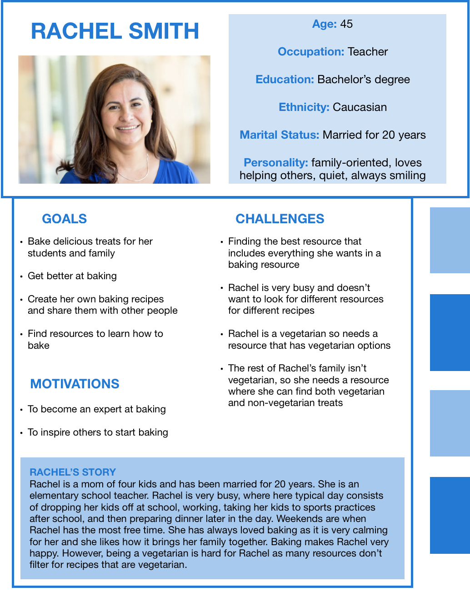
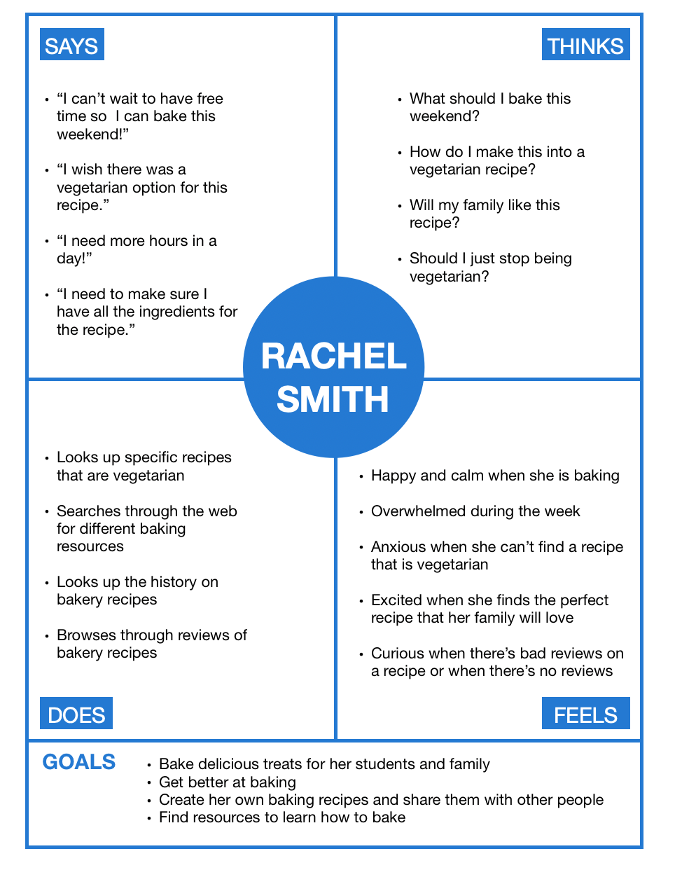
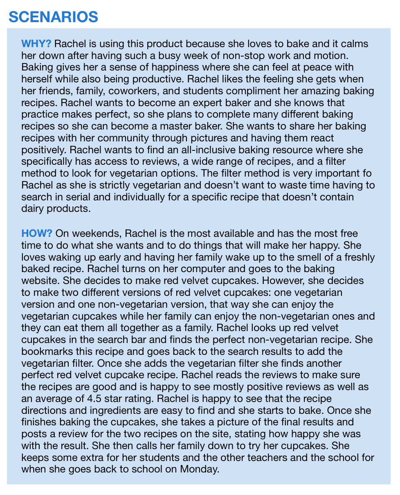
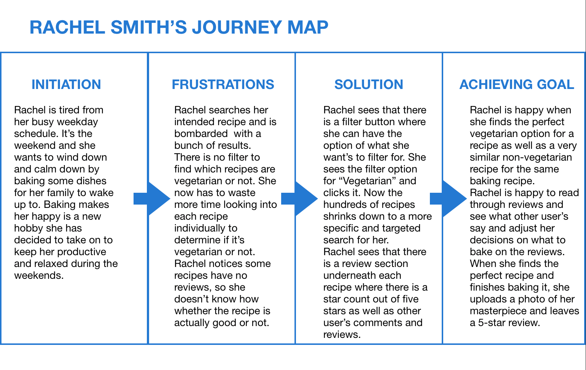

# DH150 Assignment 5: UX Storytelling by Annya Dahmani

## The Purpose of UX Storytelling
The purpose of UX storytelling is to communicate for the users, not for yourself. UX storytelling revolves around the user's story and understanding. To do this we must shift our perspective to that of the user's and look through a lens from the user's view of how they see the world. UX storytelling allows us to visualize why and how our products are being used. We create personas and stories for our team to be able to visualize this image of the user and how our product can relate to the user. The team is able to work together quickly when they have an indicated perspective of who their user is, allowing the team to be on the same page and work efficiently and cohesively. Through UX storytelling, we are able to gain information about a user and their goals, actions, behaviors, and thoughts.

## Features of design:
1. <b>Filter method:</b> This is a key feature as different people are looking for different things. This feature makes things more personalized to the user
2. <b> History of recipe:</b> This is a key feature because this allows users to understand the history of how the recipe was created and provides background context and information that user's can read about.
3. <b>Reviews section:</b> This is a key feature because it gives users insight into whether what they are looking at is popular or not as well as giving insight into what other people think of the recipe

## Rachel Smith

