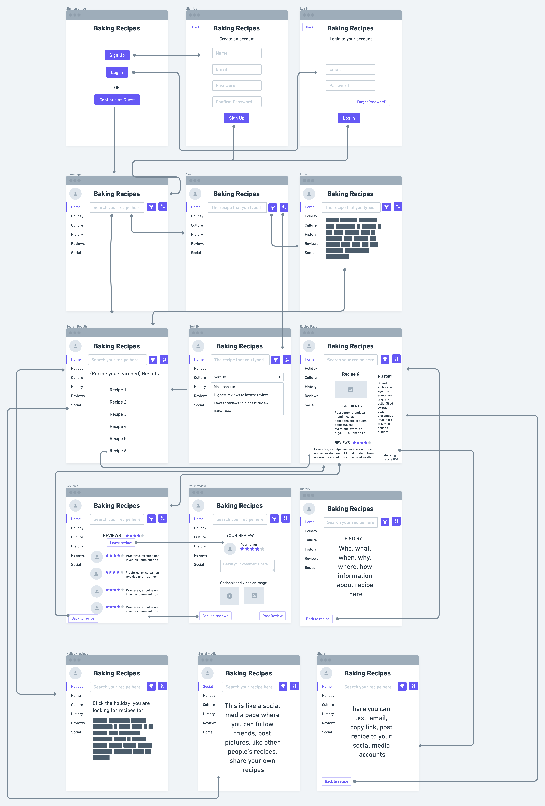
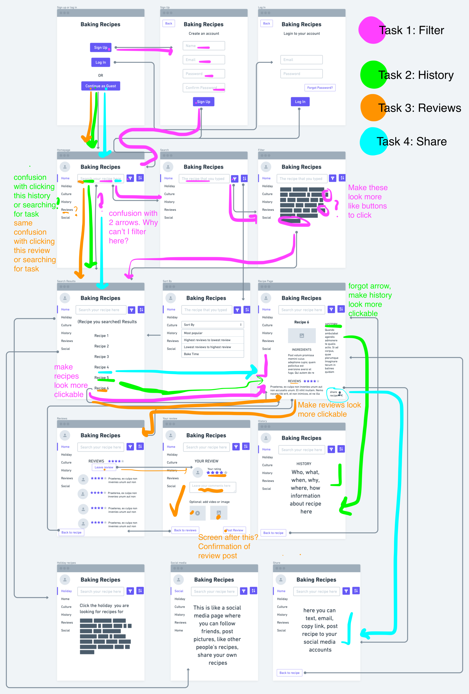

# DH150 Assignment 6: Low Fidelity Prototype by Annya Dahmani

## Project Description

### Purpose
The pruprose of low fidelity prototyping is to give insight into how a user will interact with the resource that UX designers are designing. It allows designers the ability to have user input and feedback when they are navigating the prototype's functionality and flow. As designers it gives us valuable information about whether featues in the prototype are helpful and useable or confusing and lacking something by the target user demographic. 

### User Personnas
The user personnas I created for this project can be accessed <a href="https://github.com/annyadahmani/DH150-ANNYADAHMANI/tree/main/assignment05">here</a>. Overall, my low fidelity prototype is targeted for users who are interested in baking. This can include any demographic, however, this project is specificially looking at middle-aged women's happiness, so I will be centering the demographics around this. Users should want to learn how to bake recipes, interact with other users on the resource, read and leave reviews, read the history of recipes, share recipes, and use the resource as a social media resource.

### Features
1. <b> Filter: </b> The filter feature allows user's to personalize what their search results will be. The filter feature should include vegeterian options, vegan options, dietary restrictions, etc.
2. <b> History: </b> The history includes the who, what, when, why, where, and how aspects behind the recipe. It gives users more context and background into the thing they are baking.
3. <b> Reviews: </b> The reviews feature allows users to see reviews that other people have left on the recipe as well as giving users the opportunity for them to leave their thoughts and opinions on the recipe.
4. <b> Share Recipe: </b> The share recipe feature allows for easy transportation when a user wants to send their recipe to someone else. Sharing the recipe can be done through the app itself, email, text, copy the link, or post on other social medias. This way it makes it easier than users having to type out the recipe themselves as well as not having to screenshot everything to send.
5. <b> Social Media: </b> The social media feature is something I came up with during this prototyping where the baking app has an extension where users can use it as a social media to connect with other people, like and share recipes, post their own recipes, and leave comments. I think this would be a fun way for people to engage with others when it comes to baking.
6. <b> Sort: </b> Similar to the filter feature, the sort by feature arranges the search results that a user inputs based on a specific sorting algorithm. This feature can be sorted by most popular, highest to lowest reviews, lowest tot highest reviews, and bake time. This gives users the options of finding a popular recipe or looking for the shortes baking time recipe because they don't have a lot of time to bake.

## Wireframes + Wireflow

## Testing the wireflow

The user succesfully completed all the tasks.

<b>Tasks</b>

1. Search and use a filter.
2. Find the history behind a recipe a user is looking for.
3. Locate the reviews section and allow user to write their own review.
4. Share recipe.

## Reflection
I learned a lot from creating a low fidelity prototype. First, I learned how to use Whimsical, which I thought was very useful and fun to use. This low fidelity prototype also gave me a lot of insight into the flow and functionality of my prototype. This allowed me to be able to see what I have been thinking inside of my head but have it actually written down. It also inspired me into coming up with new ideas that I hadn't thought of before that would make a baking resource even better for users. An example of this was I thought maybe incorporating social media could be a unique, fun, and interesting feature to add to a baking app. The process went overall pretty smoothly, especially figuring out how to visualize my features that I wanted to look at. Something that went differently from my expectation was the flow of my wireframe in some areas. I think I could have done a better job with the arrows and connectors with only having one connector for each frame because it could get confusing knowing which arrow is associated with what aspect of the frame. Something I would change or design differently based on the feedback I got from the prototype testing is making the headings of the recipe page look more like buttons where they can be clicked than just text. The user seemed confused on if and what was supposed to be clicked to continue the flow. Another thing I would change based on the feedback was having a frame that confirms the user's review was posted and shows that the review was posted. I could have also done a better job with making the filter options more clear that each block was a different choice and clicking one of the blocks is equivalent to choosing a specific filter. I also had forgotten to put a flow arrow between the recipe's page and when the history section was clicked having the arrow go to the history page. Because I thought it would be extensive to have the user do too many tasks, I decided to not have the user do the tasks of finding a holiday recipe and the social media feature. But I still included some low fidelity frames of these features but didn't include the parts further following clicking and usability on these frames. In the future I want to incorporate these features more and test those on users.
