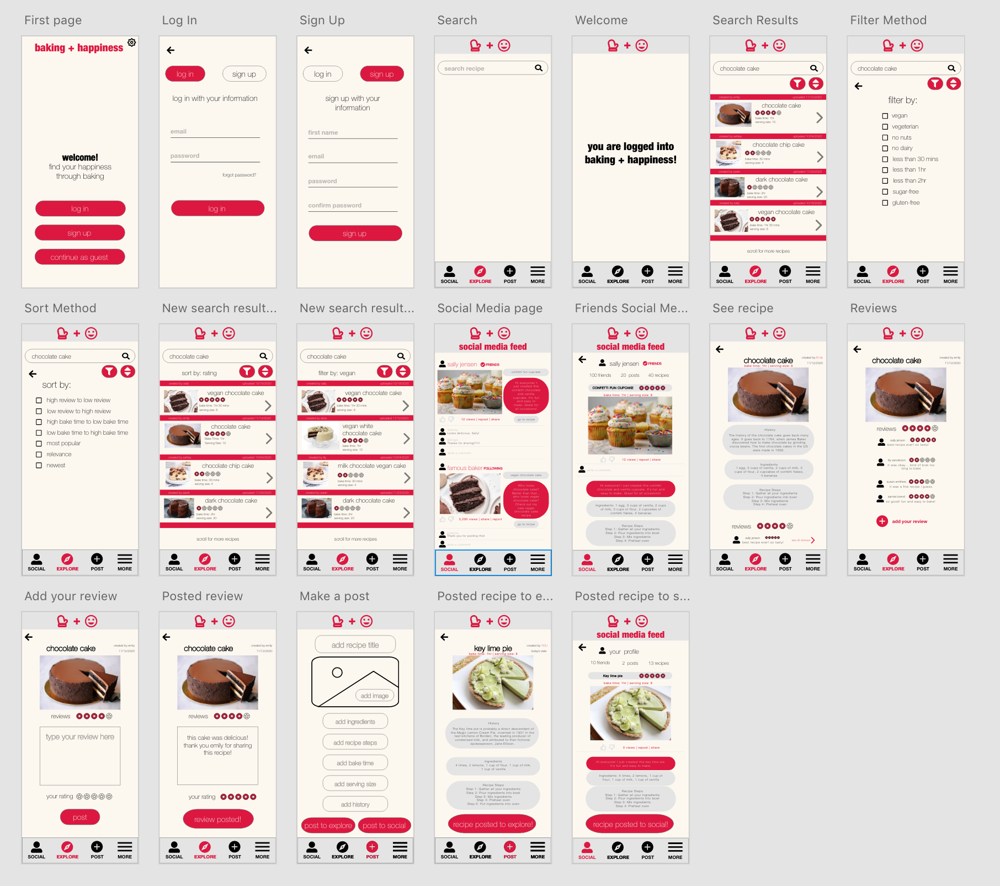
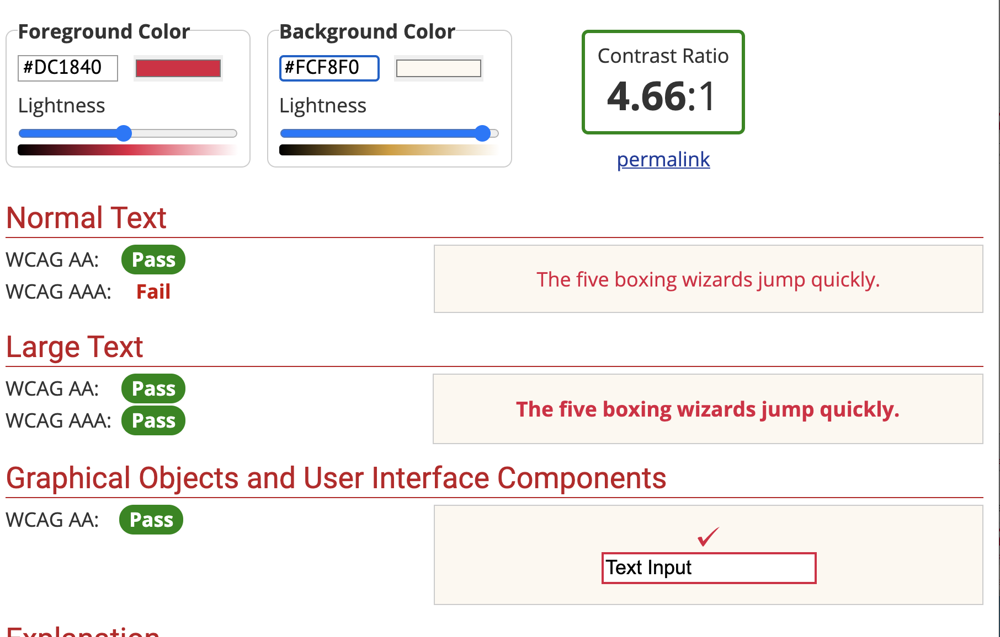
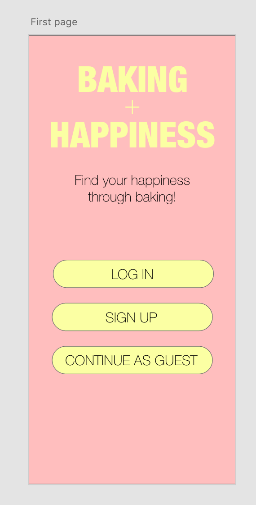
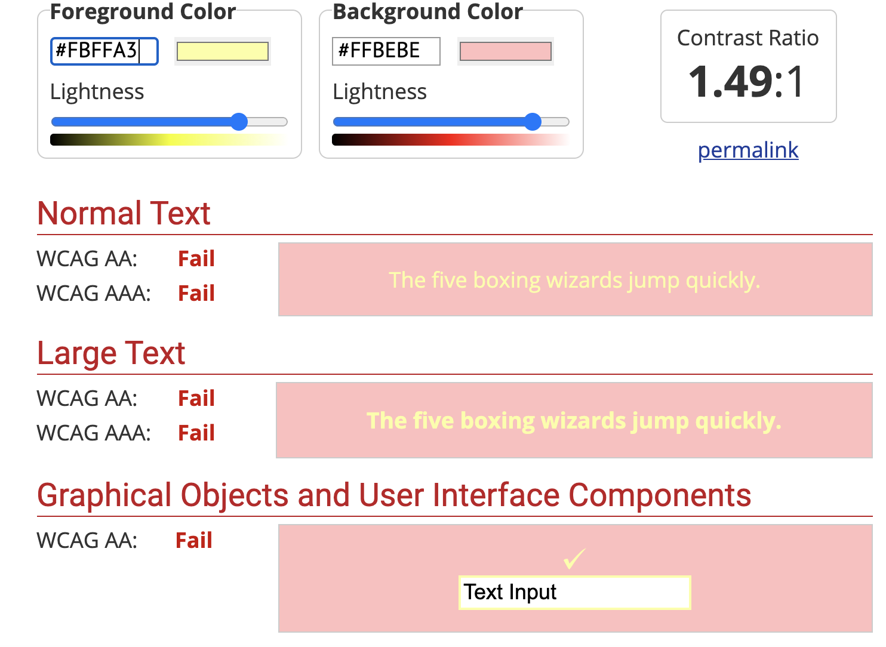
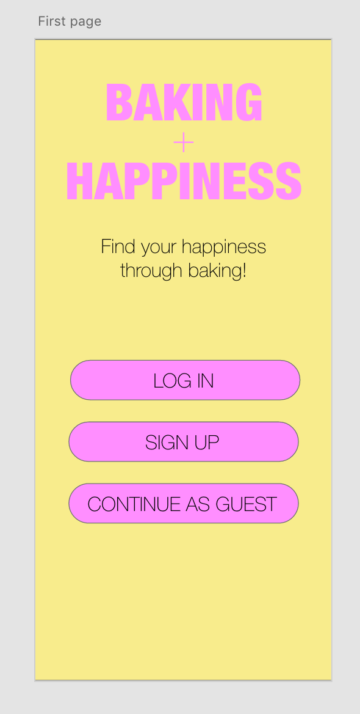
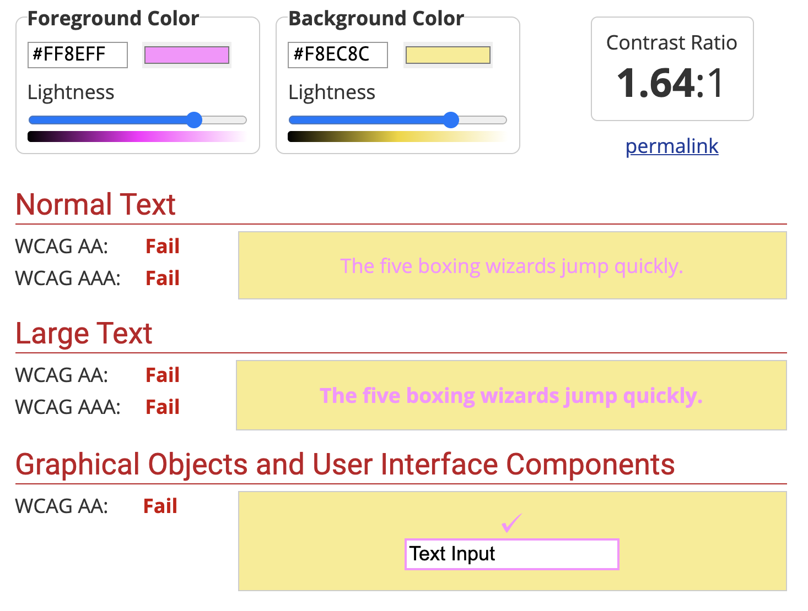

# DH150 Assignment 7: High Fidelity Prototype by Annya Dahmani

## Description of project

### Summary of project
My project is surrounded on the happiness of a mid-aged woman. Specifically, I am focusing on baking. I decide to create an app called Baking + Happiness that does just this. This app allows users to search and explore new recipes that they would later bake. Users are able to leave reviews on recipes and give their comments and a star rating based on their thoughts on a recipe. Another important aspect of the app is the social media aspect. While users can use the app for solely the purpose of searching baking recipes and baking them, users also have the option of creating a social media feed integrated into the app. On this social media page, users are able to post their own recipes as well as interacting with their friends and users they follow. Users are able to see recipes that their friends and users the follow create and leave comments, like, dislike, and share the recipes. This social media aspect integrated into the app makes it easier to have one place where users search recipes and share their creations, rather than searching a recipe on a solely baking recipe app, then posting the results on a different app solely for social media.

### Purpose of this prototype
My high fidelity prototype can be accessed <a href="https://xd.adobe.com/view/b16a7180-907e-4c6d-455d-db2ed646b141-c75b/">here</a>. The purpose of this prototype is to see 

### Tasks
* <b>Filter:</b> The filter feature allows for users to personalize their searches by filtering for things they are looking for in a recipe and filter out things they do not want in a recipe.
* <b>Social Media Feed:</b> The social media feed feature allows users to interact with their friends and famous people they follow to see their posts and new recipes they've created. Users are also able to comment, like, dislike,  and share other user's posts and recipes. Users are also able to post their own recipes to their feed for their friends and followers to see
* <b>Review:</b> The review feature allows for users to see other's recipes and see reviews that people left on their  recipe. User's are also able to leave their own reviews on the recipe.
* <b>Sort:</b> The sort by feature allows users to sort the recipes they are looking at in a certain way, which allows users the power to see what recipes they see first and last in a list.

## Graphic design

### Screen 1

### Screen 2

### Screen 3

## Impression test

### Summary of findings

## Accessibility check

### Color 1

### Color Contrast Check

### Color 2

### Color Contrast Check

### Color 3

### Color Contrast Check

### Summary
Starting off with the design, I knew I did not wanta simple white versus black design. White backgrounds pose a lot of problems with the painfulness of how bright it can be. In addition, I avoided black text on white background because this helps dyslexia, Irien Syndrome, light sensitivity, and autism. I was looking for colors that were feminine, calm, and happy. For the feminine color I wanted to use a pink or red color. For the calm color I wanted to use a pale and neutral color in the background. For the happy color, I wanted to use a shade of yellow somewhere in the design. I came  up with the following three color schemes and tested each of them based off the WCAG2.0 AA level. Color 1 was the only one that passed the check, so I decided to use that color scheme for my design. 
