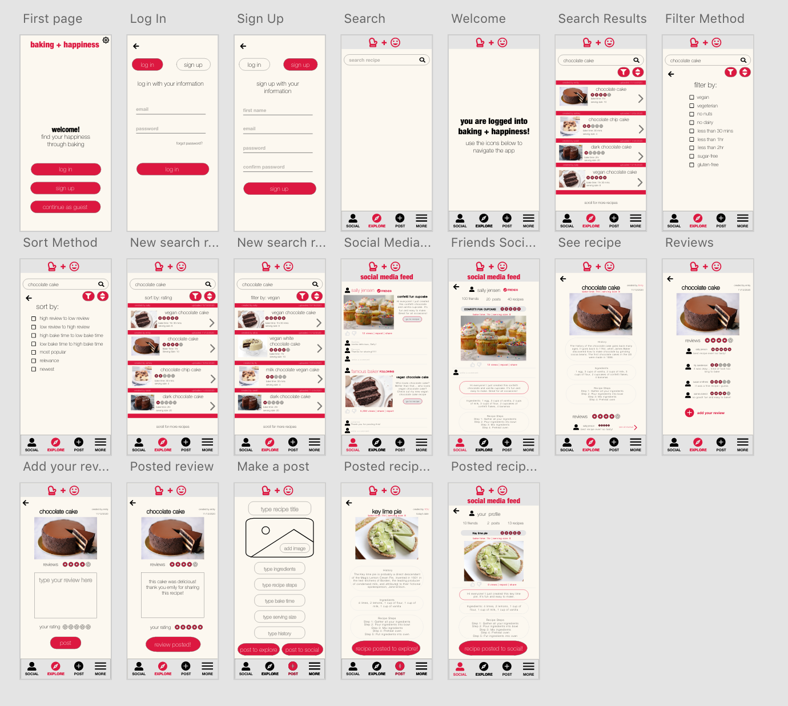
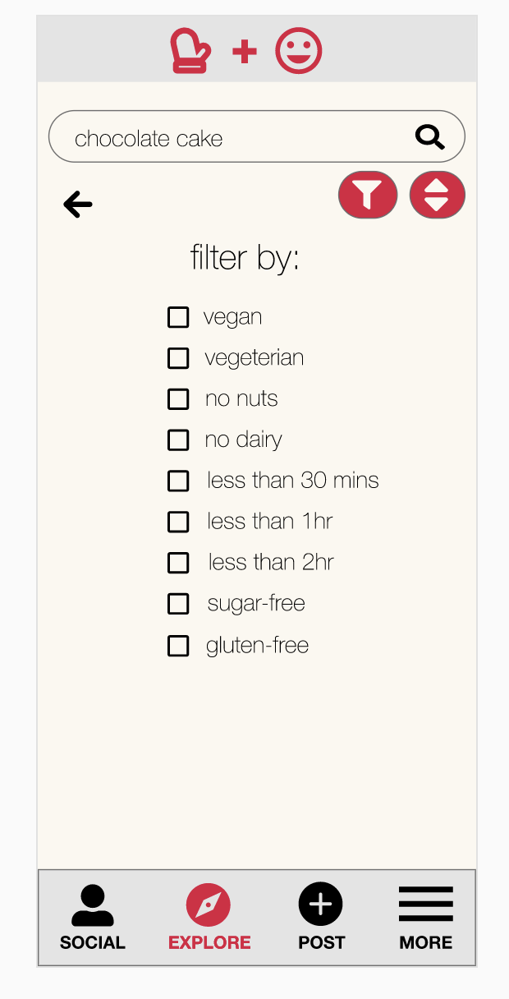
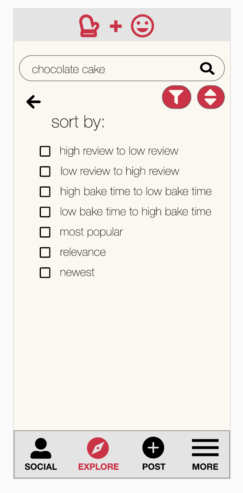
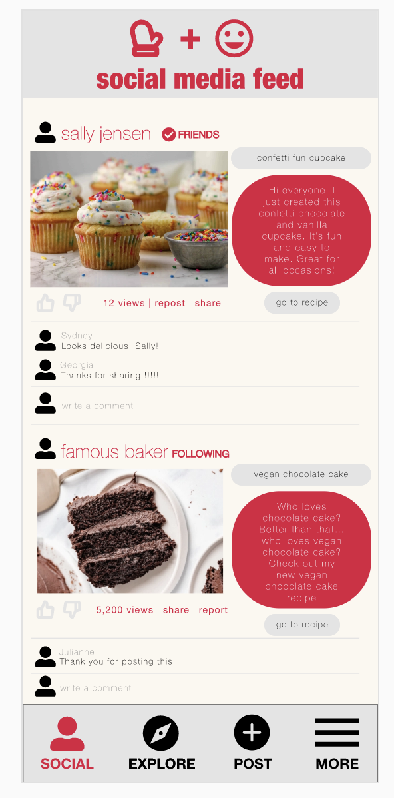
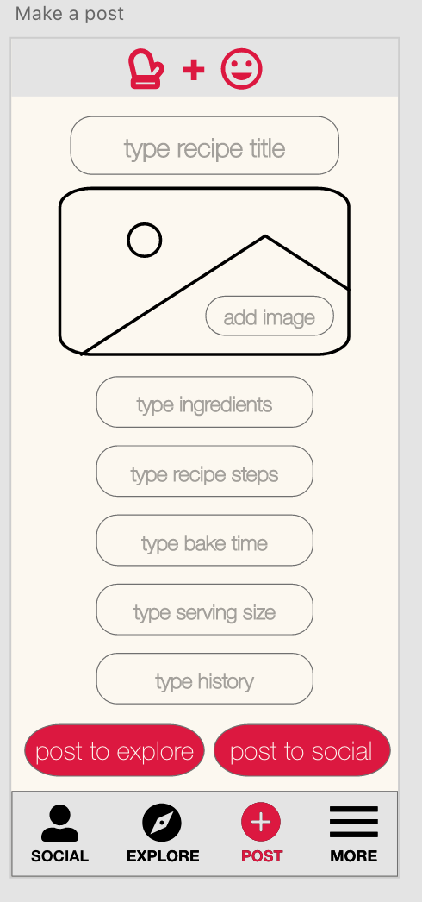
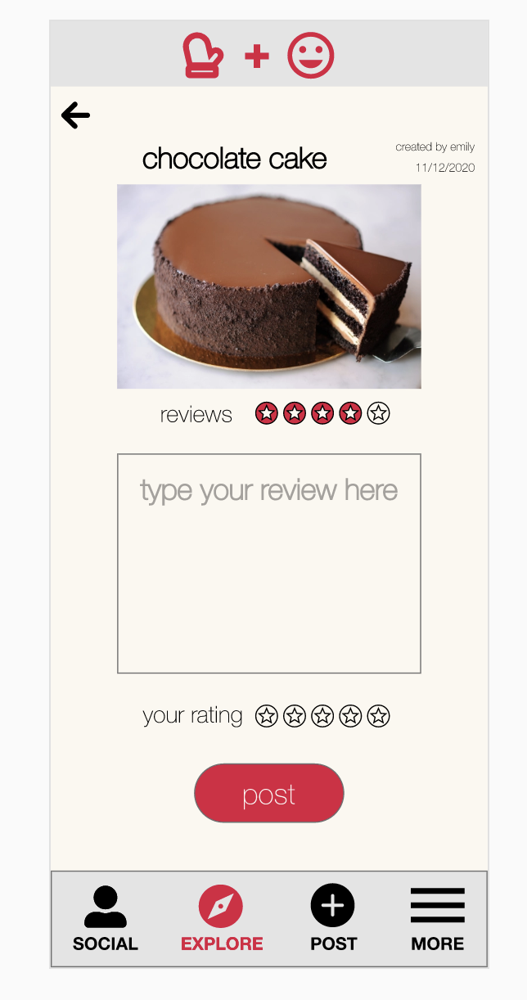
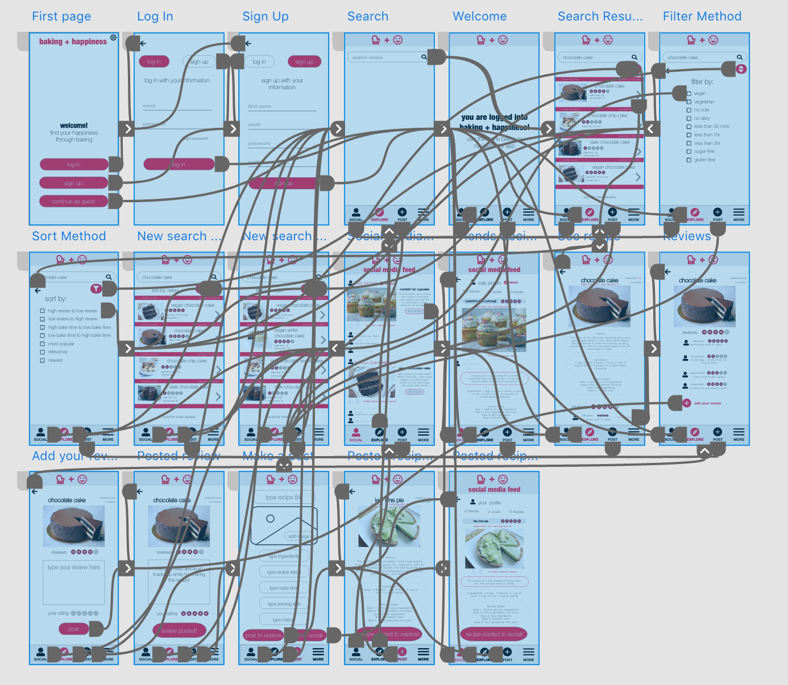

# DH150 Assignment 7: High Fidelity Prototype by Annya Dahmani

## Description of project

### Summary of project
My project is surrounded on the happiness of a mid-aged woman. Specifically, I am focusing on baking. I decide to create an app called Baking + Happiness that does just this. This app allows users to search and explore new recipes that they would later bake. Users are able to leave reviews on recipes and give their comments and a star rating based on their thoughts on a recipe. Another important aspect of the app is the social media aspect. While users can use the app for solely the purpose of searching baking recipes and baking them, users also have the option of creating a social media feed integrated into the app. On this social media page, users are able to post their own recipes as well as interacting with their friends and users they follow. Users are able to see recipes that their friends and users the follow create and leave comments, like, dislike, and share the recipes. This social media aspect integrated into the app makes it easier to have one place where users search recipes and share their creations, rather than searching a recipe on a solely baking recipe app, then posting the results on a different app solely for social media.

### Purpose of this prototype
My high fidelity prototype can be accessed <a href="https://xd.adobe.com/view/b16a7180-907e-4c6d-455d-db2ed646b141-c75b/">here</a>. The purpose of this prototype is to see how a creator's protoype will actually function. This step is important because it incorporates design as well as functionality. High fidelity prototypes are more realistic than low fidelity prototypes a nd allow for actual user interactions. This is important as we can see how users are actually using our prototype. High fidelity prototypes are very close to the actual representation of what the designer's user interface is going to be. It allows creators the opportunity to test their products before releasing it.

### Tasks
* <b>Filter:</b> The filter feature allows for users to personalize their searches by filtering for things they are looking for in a recipe and filter out things they do not want in a recipe.
* <b>Social Media Feed:</b> The social media feed feature allows users to interact with their friends and famous people they follow to see their posts and new recipes they've created. Users are also able to comment, like, dislike,  and share other user's posts and recipes. Users are also able to post their own recipes to their feed for their friends and followers to see
* <b>Review:</b> The review feature allows for users to see other's recipes and see reviews that people left on their  recipe. User's are also able to leave their own reviews on the recipe.
* <b>Sort:</b> The sort by feature allows users to sort the recipes they are looking at in a certain way, which allows users the power to see what recipes they see first and last in a list.

## Graphic design
### Original frames

### Updated frames based off cognitive walkthrough

### Filter

  Description: I decided to make the filter feature designed with check boxes based off my low fidelity prototype. In the low fidelity prototype I originally had the filter feature designed as blocks where a user would click the box they wanted filtered. However, this design was confusing to the user in the low fidelity impression test, and I decided a check box filter feature would be more straightforward and minimalistic. I used a button that looks like a funnel filter as the feature function because I thought users would understand this meant to filter.

### Sort

  Description: Similar to the filter feature, I decided to make the sort feature designed with check boxes based off my low fidelity prototype. In the low fidelity prototype I originally had the sort feature designed as blocks where a user would click the box they wanted sorted. However, this design was confusing to the user in the low fidelity impression test, and I decided a check box sort by feature would be more straightforward and minimalistic. I used the sort button, illustrated by one arrow pointing up and down, because this seemed like something a user would understand as referencing sort by function.

### Social feed
#### Original social feed

#### Updated social feed based on cognitive walkthrough

  Description: For the social feed, I was going for a simple design where there wasn't too much going on. In this design I had a user, a  user's relationship to that user, title of recipe, caption, a picture of the recipe, number of views,  repost, share, like, dislike, and comments. I think these are important features to have on a social media feed. I also had a button that has a go to recipe, so user's can easily go from social media post to the recipe that the user posted.

### Make a post
#### Original make a post 

#### Updated make a post based on cognitive walkthrough

  Description: The make a post screen is supposed to be simple and straightforward where a user simply inserts the things that are asked. The user then has the option of posting to either the explore page or to their social media page. Once the sections are filled, the app will design the layout itself, so all the user has to worry about is providing the content.

### Write a review

  Description: The write a review  screen is supposed to be minimalistic and easy to navigate and know what to do. All users have to do is provide their written review and a star rating. Then the user can post the review. I added a photo of the recipe and the overall reviews as well as who created the recipe so that users can reference this when writing their review and they don't have to recall a lot of information since it is there for them to recognize.

## Impression test
The link to a screen recording of the impression test can be accessed <a href="https://drive.google.com/file/d/1R4g8hMkNexPE03ncxGYpZ3XKR3Hg3S99/view?usp=sharing">here</a>.

### Summary of findings
* Filter task: the user completed the task, but had some difficulty knowing which was the correct box to tick off to see the filter results
* Sort task: the user completed the task, but could have navigated the task easier. The user could have simply clicked the sort button immediately, but instead went all the way back to search results and then clicked sort. In this part the user acknowledged she was confused on how to get to the sort feature.
* Finding a recipe: user said she wishes there was a better way of getting straight to the recipe from the sort feature instead of having to go back.
* Seeing reviews: user said it was very easy to find the reviews.
* Make a review task: user said it was very easy to add a review. Was confused why she couldn't add her own star rating.
* User said maybe instead of "Explore" at the bottom it should say "Search."
* Social feed task: user said it was easy to see get to the social media feed. User commented saying the captions were hard to read the yellow font on the red background. User said to make the go to recipe button look more like a button and different from the title of the recipe.
* Post a recipe: user said it was easy to post a recipe. Commented again on the yellow task over red background for the captions.

## Accessibility check

### Color 1

### Color Contrast Check

### Color 2

### Color Contrast Check

### Color 3

### Color Contrast Check

### Summary of color check
Starting off with the design, I knew I did not wanta simple white versus black design. White backgrounds pose a lot of problems with the painfulness of how bright it can be. In addition, I avoided black text on white background because this helps dyslexia, Irien Syndrome, light sensitivity, and autism. I was looking for colors that were feminine, calm, and happy. For the feminine color I wanted to use a pink or red color. For the calm color I wanted to use a pale and neutral color in the background. For the happy color, I wanted to use a shade of yellow somewhere in the design. I came  up with the following three color schemes and tested each of them based off the WCAG2.0 AA level. Color 1 was the only one that passed the check, so I decided to use that color scheme for my design.

### Interactive prototype
My high fidelity prototype can be accessed <a href="https://xd.adobe.com/view/b16a7180-907e-4c6d-455d-db2ed646b141-c75b/">here</a>.

### Wireflow (Diagram)

### Cognitive walkthrough
Based on the cognitive walkthrough, I made edits to my original high fidelity prototype based on comments I received. 

Comments from the cognitive walkthrough as well as comments addressing them:
* Home sceen: "i like the colors!" "screen makes it clear that app is about baking!" "very clear homepage, nice call to action buttons"
* Search screen: "i feel like the whole search bar should be clickable, as the user would click on the search bar to type." **Addressing comment:** I decided to make a revision to my prototype by allowing the whole search bar to be clickable rather than just the search icon.
* Welcome screen: "This screen can be a little confusing, since it's not immediately clear that the user should click on 'Social'/'Explore'/'Post.'" "I like how they show the user that they successfully logged in, but it's unclear where they should click next." **Addressing comment:** I decided to add a text below the welcome text to let users know to navigate the app they must click one of the menu options at the bottom.
* Social media page screen: "call to action buttons are not very visible, unclear on where to click." **Addressing comment:** I decided to make the "go to recipe" button look more like a button and more visibile to click
* Make a post screen: "kind of confusing whether they are fillable input fields or buttons, users would be unsure what to do." **Addressing comment:** I decided to replace "add" with "type" to make it more clear that it is supposed to be fillable input and not buttons.
* Posted recipe to social screen: "text is hard to see because it's small/thin." **Addressing comment:** I made the text bigger and removed the background fill.
* Color: "i like the color palette!"
* Screen feedback: "all clear with headings!" "I have a feeling that people might often get confused between explore and social."
* Is there any point that the users may not recognize where to click or select?: "Maybe for the first-time users. They might be confused when there's just a search bar on the page." "some call to action buttons are not very visible, such as "go to recipe" on social screen; i feel like the whole search bar should be clickable, as the user would click on the search bar to type on explore screen" **Addressing comment:** I made the  "go to recipe" button more visibile, made the full search bar clickable.
* Flow between screens: "all screens have return button"
* Other comments: "some of the text is very thin and small, may be hard to see" **Addressing comment:** I made some of the text bigger font and bolder. The overall typography is thin for a aesthetic and minimalistic design.

### Relfection
The process of creating a high fidelity prototype was fun and it was exciting to see my low fidelity prototype transform into something new. I was inspired from my low fidelity prototype of making this baking app into a social media platform. A lot went smoothly from transitioning from low fidelity to high fidelity. Since I already had the skeletal frame done from the low fidelity prototype, I just had to revise some of my work and make my the prototype more visually appealing, real, and interactive. I already had an idea of what I wanted to do color-wise for my prototype. I knew I wanted feminine and happy colors. The accesibility color-contrast check went smoothly, where I was able to check three colors. Only one color passed the color-contrast checker, thus I was forced to use this color combination. Something I would have done differently is try to find another color scheme that passed the color checker, so I didn't feel forced into using the color I chose because it was the only color of the three that I tested for that passed. Another thing I wish I could change was possibily finding a better typography. The one I am curently  using is Helvetica Neue. I liked how thin, calm, and minimalistic it looked. However, I received comments that the font was too small or too thin, so maybe this was just a personal preference and maybe isn't generally good. Furthermore, since this project is targeted toward middle-aged women, it is important to note that their eyesight might not be as good as mine, thus having more difficulties with the typography. Another thing that went smoothly was coming up with the menu items I wanted in the menu dock below the app. I simply thought of the most important things that someone would want in a menu bar. One other thing that I would change or design differently is the design of my social media page. I think I could have done a better job of making it look more minimalistic, but it was hard to know and decide what parts of a social media feed are the most important. I included pictures, captions, comments, like and dislike buttons, adding a comment, views, share, title, and go to recipe. I am unsure if I truly needed all those features in the social media feed or if it just ended up being too distracting and filled in the end.
